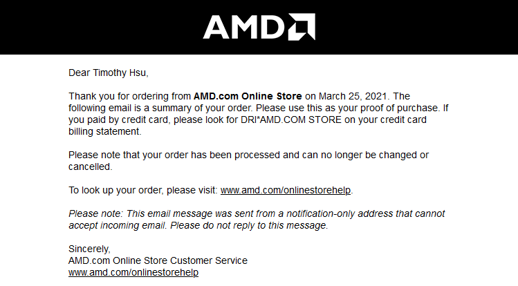
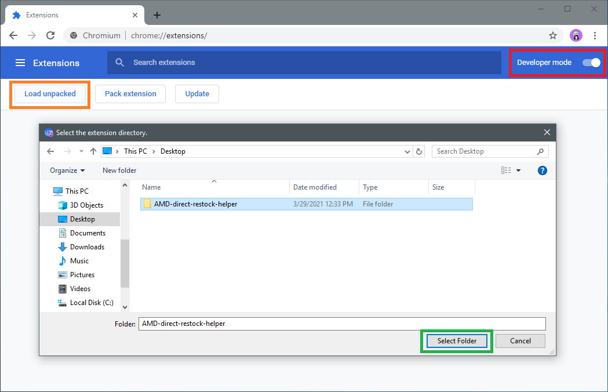
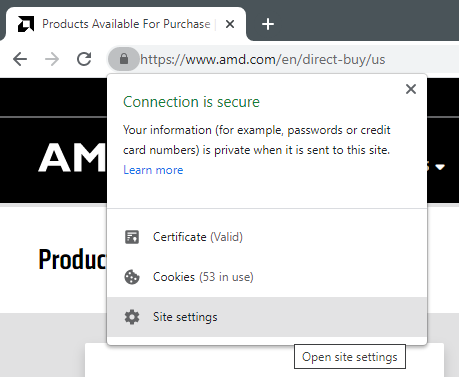
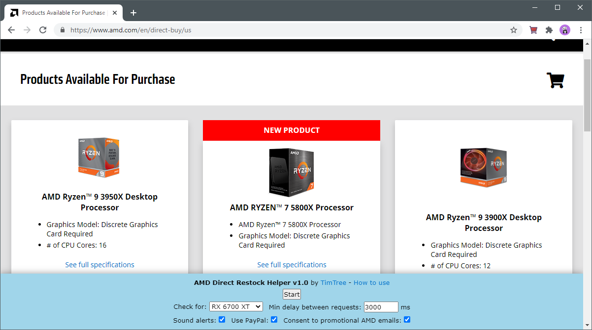
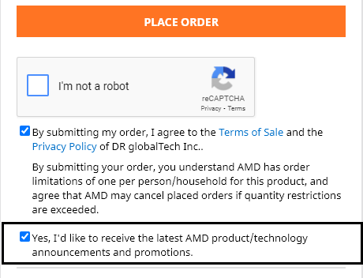
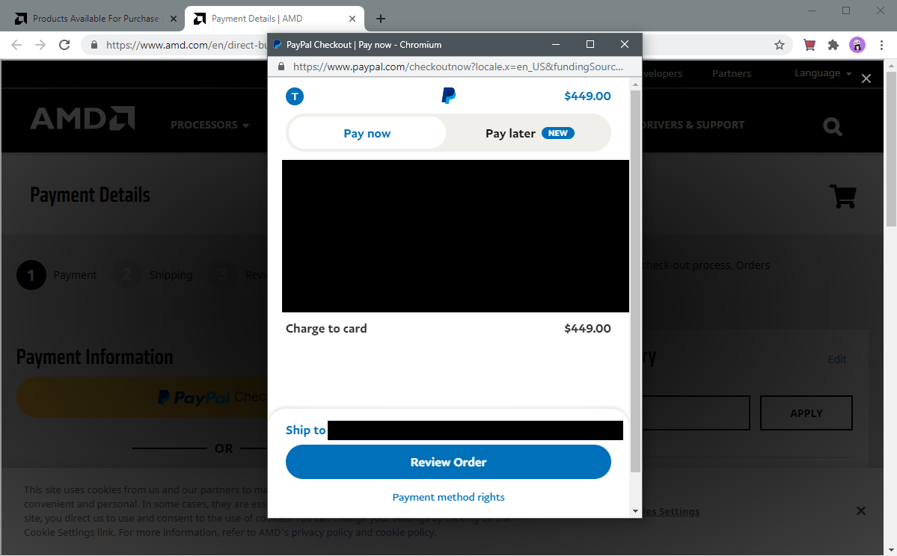
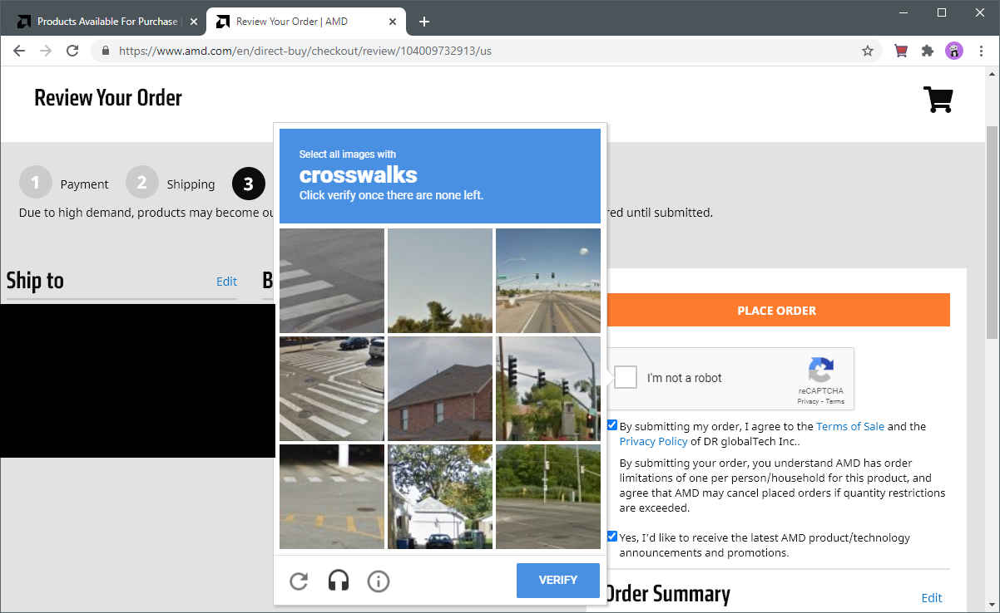

# AMD Direct Restock Helper

---

<strong>

Dear users,

It is with deep sorrow that I must discontinue this project. I know it's only been two days and there hasn't been a restock since release, but this project is causing me more trouble than it's worth.

AMD Direct is actively fighting against restock helpers. Last week, they broke directly accessing their stock API, which made me rewrite the script all Wednesday to run to the context of AMD.com. Today (March 30), they added a CAPTCHA in order to check for stock. While I believe it's fixable by web scraping the product listings for stock and directly loading the CAPTCHA to add to cart, I'd have to rewrite the script again the day before a restock. As much as I want to see this through, I sadly can no longer afford the stress, pressure, and anxiety associated with this project.

This also means the technical writeup will no longer happen, since there's little point discussing methodology that no longer works. (I haven't started writing it anyway.)

If you'd like to continue the work done on this project, feel free to fork/clone this repo. I am more than happy to answer any clarifying questions via the contact methods at the end of the FAQ.

I continue to wish all of you the best getting that new graphics card. May more cards arrive to the hands of those who will actually use it.

~ TimTree

</strong>

---

[**Download the latest release [Source code (zip)]**](https://github.com/TimTree/AMD-direct-restock-helper/releases/latest)

Buying a new graphics card at MSRP is incredibly hard these days, thanks to sky-high demand from gamers, cryptocurrency miners, and scalpers. It oftentimes feels impossible to beat the bots before they snatch the cards.

So if we can't beat 'em, let's join 'em.

This browser extension helps you buy any desired product from the [AMD Direct store](https://www.amd.com/en/direct-buy), including the [RX 6700 XT](https://www.amd.com/en/direct-buy/5496921400/), [RX 6800](https://www.amd.com/en/direct-buy/5458373400/), [RX 6800 XT](https://www.amd.com/en/direct-buy/5458372800/), and [RX 6900 XT](https://www.amd.com/en/direct-buy/5458372200/). When a restock happens, a new tab will automatically open initiating checkout for the item of your choice.

**All you'll have to do is complete PayPal One Touch, solve a CAPTCHA, and click PLACE ORDER.**

Other open-source restock helpers include this [Python program for Amazon](https://github.com/Hari-Nagarajan/fairgame) and this [TamperMonkey script for Best Buy](https://github.com/albert-sun/tamper-scripts).

## Does it work?

On March 25, 2021, I successfully purchased the RX 6800 XT at AMD Direct thanks to the helper. Here's my proof of purchase. (I'll update with a photo of my card once I receive it.)

## Disclaimers

* The helper cannot guarantee you'll get a graphics card. You must be present on your computer when a restock happens and be quick enough to complete any manual steps.

* The helper is designed to only checkout **ONE product**. Bulk buying will never be added as the intent is to help gamers, NOT scalpers.

* You may receive a temporary IP ban from AMD.com if the helper refreshes for stock too quickly. These bans tend to last for a few minutes, and you can configure the settings to refresh at a slower pace.

* The helper directly edits AMD.com cookies. If for any reason you have important cookies at AMD.com, install the extension in a [separate profile](https://linuxhint.com/use_multiple_profiles_simultaneously_google_chrome/).

* **I AM NOT RESPONSIBLE FOR ANY FINANCIAL ISSUES, IP BANS, OR OTHER LIABILITIES WHEN USING THE HELPER. USE AT YOUR OWN RISK.**

## Installation and prep

**PLEASE READ CAREFULLY. It is CRUCIAL you understand/complete EVERY step.**

### Installing the helper

To use the helper, you'll need the latest version of **Google Chrome** or **Chromium** on **desktop**.
* Microsoft Edge, Brave, Vivaldi, or any other Chromium-based browser might work, though not tested.
* Firefox, Safari, and mobile browsers are not currently supported.

I strongly recommend using the helper in a [separate Chrome profile](https://linuxhint.com/use_multiple_profiles_simultaneously_google_chrome/) so it doesn't interfere with your normal browsing data.

1) Download the `Source code (zip)` of the [latest release of AMD Direct Restock Helper](https://github.com/TimTree/AMD-direct-restock-helper/releases/latest).

2) Unzip the download. One folder should be extracted.

3) Go to the Chrome Extensions menu (`chrome://extensions/`). Enable Developer mode.

4) Click "Load unpacked" and select the extracted folder.

Congrats, you have installed AMD Direct Restock Helper!

### Updating the helper

The helper will notify you if a new update is available. To update:

1) Remove the previous version of the helper from Chrome.

2) Repeat the above installation steps.

### Setting up PayPal One Touch

The fastest way to checkout at AMD Direct is through PayPal, and it's even quicker if you enable One Touch to automatically log you in.

1) [Log in to PayPal.](https://www.paypal.com/us/signin) If you don't have an account, [create one.](https://www.paypal.com/us/webapps/mpp/account-selection)

2) Go to the [PayPal One Touch page](https://www.paypal.com/us/webapps/mpp/one-touch-checkout) and complete the steps.

3) Double-check that your shipping address and default payment method on PayPal is accurate.

### Enabling pop-ups at AMD.com

The "Pay with PayPal" button during checkout opens as a pop-up window, which is blocked by default in Chrome. You need to override this preference.

1) On [AMD.com](https://www.amd.com), click the padlock on the address bar -> Site settings.

2) In the permissions list, change Pop-ups and redirects to Allow.

## Usage

**PLEASE READ CAREFULLY. Make sure you COMPLETELY understand how everything works!**

On the AMD Direct Buy webpage, you'll find the Helper pane.

You can configure the following settings:

|Setting |Description  | Default|
--- | --- | ---
|**Check for**|Set the desired product you want to monitor for stock.|*RX 6700 XT*|
|**Min delay between requests**|Set the minimum time (in milliseconds) the browser waits before checking for stock again. The lower the delay, the higher the risk of getting temporarily IP banned, so adjust carefully! |*3000 ms*|
|**Sound alerts**|Receive a sound alert when your desired product is in stock and when you get IP banned.  [In-stock sound effect preview](https://notificationsounds.com/message-tones/pristine-609), [IP ban sound alert preview](https://notificationsounds.com/message-tones/moonless-591) |*checked*|
|**Use PayPal**|Automatically click "PayPal Checkout" on the checkout page. Uncheck if you don't want to use PayPal, though not recommended. |*checked*|
|**Consent to promotional AMD emails**|Choose if you want the extension to check "Yes, I'd like to receive the latest AMD product/technology announcements and promotions" on the checkout review page.  |*checked*|

Once you're happy with your settings, press the Start button to start checking for stock.

The helper keeps a running count of the amount of stock checks, as well as the response of the last check. Responses are as follows:

|Response |Description  |
--- | --- |
|**Not in stock**|The product is not currently in stock.|
|**Listing in maintenance**|When checking for stock, AMD stock API redirected to a maintenance page. This typically means the product isn't in stock, and it should change back to "Not in stock" when a restock nears. If you get this message on an item in stock, it means AMD is onto us and broke the helper. Fun fact: this actually happened during my initial runs. Please [file an issue](https://github.com/TimTree/AMD-direct-restock-helper/issues) if you encounter this. |
|**Temp IP ban - 403**|Your IP address has been temporarily banned from AMD.com for refreshing too quickly. The ban usually lasts for a few minutes. In the meantime, pause the checks and readjust the min delay between requests. (>=2000 ms is probably safe.) |
|**Client error - 4xx**|Any HTTP 400 error that isn't an IP ban. I haven't encountered this yet, but just in case, it's here. Stock checks will continue as normal. |
|**Server error - 5xx**|AMD's servers are overloaded with too many other people checking for stock. You'll often see this on Thursday mornings (when restocks usually occur), but don't worry. While everyone's fighting for the checkout page, you have an advantage with auto-refresh. ;) |
|**No Internet connection**|Uh oh, your Internet's kaput! Make sure you fix that ASAP. |
|**In stock**|The product is in stock! When this happens, stock checks automatically stop, and a new tab will open to the checkout page. Once you (hopefully) checkout successfully, compare the attached timestamp the product went in stock with popular Twitter/Discord bots!|
|**Unhandled parsing error**|An unknown error occurred related to handling the data the AMD stock API returned. Stock checks will continue as normal. You should [file an issue](https://github.com/TimTree/AMD-direct-restock-helper/issues) for these errors. |
|**Unhandled connection error**|An unknown error occurred related to retrieving the data the AMD stock API. Stock checks will continue as normal. You should [file an issue](https://github.com/TimTree/AMD-direct-restock-helper/issues) for these errors.  |

When a restock happens, the helper automatically opens the checkout page and clicks "PayPal Checkout" (if Use PayPal is checked). Provided you've enabled PayPal One Touch, PayPal automatically logs you in and take you to this page.

Once you click "Review Order," the checkout review page loads (if the product is still in stock). The helper automatically checks the Terms of Sale, promotional email consent (if enabled in settings), and the CAPTCHA.

Once you solve the CAPTCHA, click PLACE ORDER and pray.

If you're booted back to the main products page after PLACE ORDER, that doesn't necessarily mean you've lost. Check your email. If PayPal said you've made a payment to DigitalRiver, you've won!

### Checking for multiple products

You can only check for one product at a time per Chrome profile. This is intentional to ensure you don't unexpectedly add multiple products to your cart.

But let's say you want to check for the RX 6800, RX 6800 XT, and RX 6900 XT and am willing to buy whichever shows up in stock first. Totally understandable; not every graphics card model will restock, and you want to cover your bases. All you have to do is use [separate Chrome profiles](https://linuxhint.com/use_multiple_profiles_simultaneously_google_chrome/) for each product. You'll have to repeat the installation multiple times, but it's worth the hassle, right?

Keep in mind you should **adjust the min delay between requests** for each product, as you're now pinging the AMD server twice as much, thrice as much, etc. For example, if you use a 2000ms delay with one product, setting the delay to 4000ms for two products will maintain the same request cadence. As checking for more products increases the necessary delay, it's up to you to determine cost/benefit.

> For context, when I snagged my RX 6800 XT, I checked for the RX 6800, RX 6800 XT, and RX 6900 XT with a 2000ms min delay for all three graphics cards.

### Tips and advice

* **AMD Direct usually restocks on Thursday mornings (8-11am Pacific Time).**
    * Since you need to be present when the restock happens, prepare to stay near your computer for this time block.
    * That said, you shouldn't need to stare at your computer the entire time. As long as you're in the same room and can rush to your computer within 5 seconds of hearing the sound alert, you should be fine.
    * I recommend having the AMD Direct Buy window on a separate desktop while you focus on your other work. At least on Windows 10, the desktop should automatically switch over when the restock happens.
    * It is speculated that the AMD Direct Buy page "shuffles" the order of products right before a restock, though I cannot confirm this.

* Practice the checkout flow with the Ryzen 5800x (almost always in stock these days).
    * This is a good way to get a feel of the sound alert and check if PayPal One Touch is working properly.
    * It's ok to continue through PayPal to reach the checkout review page. You won't be charged unless you click PLACE ORDER (ABSOLUTELY don't click that; remember I'm not liable!).
    * If you're not comfortable using PayPal for practice, you can reach the checkout review page with a bogus address/email/credit card number (once again, DO NOT CLICK PLACE ORDER).

* Determine your min delay between requests ahead of time.
    * You don't want to get IP banned during the restock timeframe. See if you can leave the helper running for at least an hour without an IP ban.

* On restock day, disable your computer from sleeping when inactive.
    * You have to be quick as soon as you hear the in-stock alert. No time to wake up your computer and log in with your password.

* DO. NOT. HESITATE.
    * I cannot stress this enough. Don't let your logical brain push you out of that $999 RX 6900 XT you would have scoffed at in normal circumstances. Primal instincts. Go, go, go! Click, click, click! Buy, buy, buy!

## Technical writeup

The writeup on how the helper works behind the scenes is coming soon.

## FAQ

**Why would you release this to the public? Wouldn't this make the botting situation worse?**

Botters are gonna bot anyway, so I might as well release something that helps even the playing field for the rest of us. Although scalpers can take advantage, I believe I ultimately help gamers who intend to use their graphics card more, especially when enforcing only one product in the cart.

I'm also releasing this as a resume piece. It is my first ever browser extension, and it showcases an effective use of handling asynchronous network requests. On top of that, it's got a strong STAR method story (Situation, Task, Action, Result), especially since it worked for me.

**Why isn't this extension on the Chrome Web Store?**

I doubt Google would approve an extension that tries to automatically buy something.

**How can I make sure this extension isn't malicious?**

The extension is completely open source. If I really wanted to mess with your data, I've chosen a horrible way to do it. ;)

The extension also cannot auto-update, killing any chance of me pulling a bait-and-switch. Whenever an update releases, you can inspect all the code changes to your satisfaction before installing.

**What and how do you use the required extension permissions?**

|Permission |How it's used  |
--- | --- |
|**Access amd.com**|Necessary to load the menu pane, check for stock, and automate various steps in the checkout process|
|**Access paypal.com**|Necessary to automatically click the "Pay with PayPal" button |
|**Access google.com**|Necessary to automatically click the Google CAPTCHA button |
|**Storage**|Necessary to store extension settings outlined in the Usage header |
|**Tabs**|Necessary to check if more than one AMD Direct tab is open to prevent running the extension multiple times |
|**Cookies**|Necessary to periodically clear cookies from AMD.com. There is a separate ban for refreshing too much with the same cookies, which the extension circumvents.|
|**Notifications**|Necessary to send notifications when a product is in stock or if you're temporarily IP banned |

**Any other questions, success stories, or just want to reach out?**

**Email:** thetimhsu at Google's mail

**Discord:** TimTree#1041

## License and credits

AMD Direct Restock Helper is licensed under the GPL-3.0.

Sound alerts from [Notification Sounds](https://notificationsounds.com/).